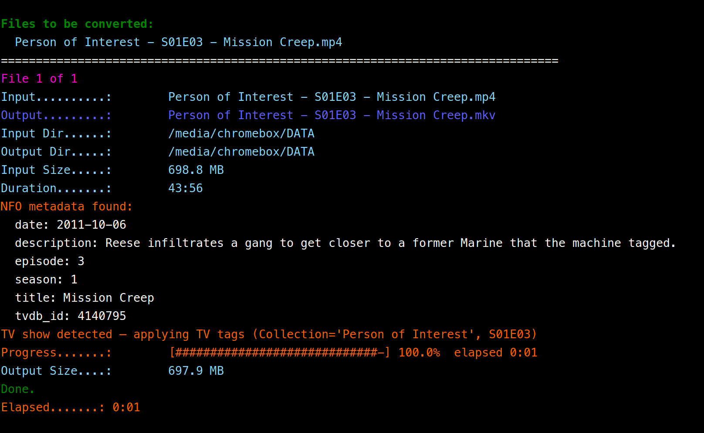
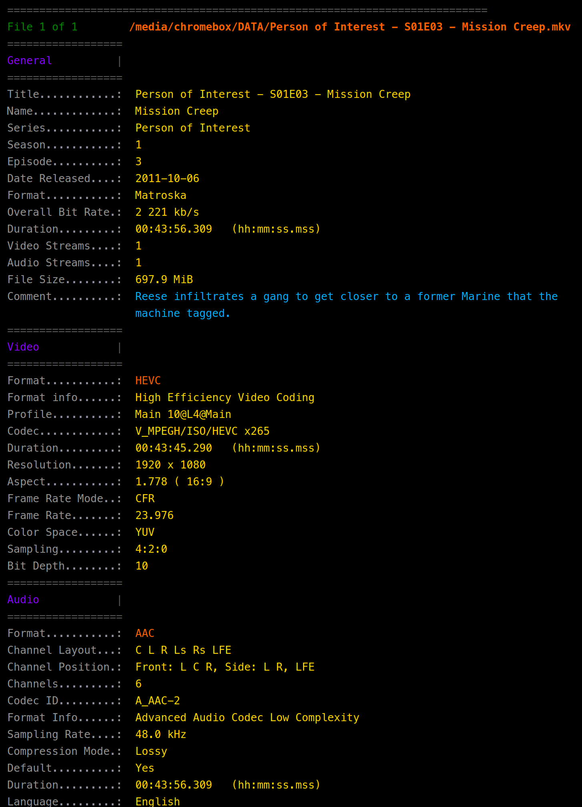

# convert_to_mkv

A Python command-line tool that losslessly remuxes video files into the MKV container using `ffmpeg` stream copy. No re-encoding takes place — every video, audio, subtitle, attachment, metadata, and chapter stream is transferred bit-for-bit into the output file.

## Features

- **Lossless remux** — stream copy only, zero quality loss, fast
- **Single file or directory** input
- **Recursive traversal** with `--depth N`
- **TV show detection and tagging** — automatically identifies TV episodes from `SxxExx` filename patterns or a TVDB ID in the sidecar NFO; writes structured `Collection`, `Season`, `Episode`, `Movie` (episode title), `Comment`, and `Released_Date` tags
- **NFO/XML sidecar metadata embedding** — reads Kodi/Jellyfin `episodedetails` XML or plain `key: value` text files and writes tags into the MKV; for TV episodes the series name is resolved from a `tvshow.nfo` in a parent directory
- **Live color progress bar** with percentage and elapsed time
- **Post-conversion validation** — checks output size and duration before declaring success
- **`--replace`** — deletes the original source file only after all validation passes
- **`--max-verify`** — optional full bitstream decode pass (`ffmpeg -f null`) with its own live progress bar; deletion is deferred until the decode is clean
- **Partial output detection** — re-converts if an existing output looks incomplete
- **Graceful interrupt handling** — Ctrl+C kills ffmpeg and removes the incomplete output file

## Requirements

- Python 3.6+
- `ffmpeg` and `ffprobe` in your `PATH`

### Install ffmpeg

```bash
# Debian / Ubuntu
sudo apt install ffmpeg

# Arch
sudo pacman -S ffmpeg

# macOS (Homebrew)
brew install ffmpeg
```

## Installation

```bash
# Copy to somewhere on your PATH and make executable
cp convert_to_mkv.py ~/.local/bin/convert_to_mkv.py
chmod +x ~/.local/bin/convert_to_mkv.py
```

## Usage

```
convert_to_mkv.py <source> [dest] [options]
```

| Argument | Description |
|---|---|
| `source` | Source video file or directory |
| `dest` | Destination directory (defaults to same directory as source) |
| `--depth N` | Recurse N levels deep into sub-directories (0 = top-level only) |
| `--replace` | Delete the original after a successful validated conversion |
| `--max-verify` | Full silent decode pass on output to catch bitstream errors (slower) |

### Examples

```bash
# Remux all videos in a directory to the same directory
convert_to_mkv.py /media/videos

# Remux to a different destination
convert_to_mkv.py /media/videos /media/mkv_output

# Remux a single file
convert_to_mkv.py /media/videos/movie.mp4 /media/mkv_output

# Recurse 2 levels deep
convert_to_mkv.py /media/shows /media/mkv_output --depth 2

# Remux and delete originals after verified conversion
convert_to_mkv.py /media/videos /media/mkv_output --replace

# Remux, full decode verification, then delete originals
convert_to_mkv.py /media/videos /media/mkv_output --replace --max-verify
```

## Supported Input Formats

`.mp4` `.avi` `.mov` `.wmv` `.webm` `.flv` `.m4v` `.ts` `.m2ts` `.mts` `.mpg` `.mpeg` `.3gp` `.ogv` `.ogg` `.rmvb` `.divx` `.vob`

## Output Validation

After every conversion the following checks run automatically:

1. Output file exists and is non-empty
2. Output size is ≥ 90% of the input size
3. Output duration is within `max(2 s, 1%)` of the input duration

If any check fails the original file is kept and the failure reason is printed. The `--replace` deletion only happens when all checks pass.

## `--max-verify` — Full Decode Pass

When passed, after the conversion and basic validation, the script runs:

```
ffmpeg -v error -stats -i output.mkv -map 0 -f null -
```

This decodes every frame of every stream to `/dev/null`, displaying a live progress bar. Any bitstream-level errors ffmpeg reports are shown and the conversion is considered failed. Since this is a full decode it takes roughly as long as the conversion itself.

**Recommended when:**
- Using `--replace` on important or irreplaceable files
- The destination is a network share (NFS, SMB) where write corruption is more likely

## NFO Sidecar Metadata

The script looks for a sidecar file matching the source filename stem:

```
/media/shows/My.Show.S01E01.mp4   →   looks for My.Show.S01E01.nfo  or  My.Show.S01E01.xml
                                        also checks   /media/shows/.nfo/My.Show.S01E01.nfo
```

Only exact basename matches are used — unrelated `.nfo` files elsewhere in the directory are ignored.

### Supported formats

**Kodi / Jellyfin XML** (`episodedetails`):
```xml
<?xml version="1.0" encoding="UTF-8"?>
<episodedetails>
  <title>Naughty or Nice</title>
  <season>10</season>
  <episode>2</episode>
  <aired>2019-10-04</aired>
  <plot>Frank and Erin are at odds when Frank learns the district attorney's office...</plot>
  <uniqueid type="tvdb" default="true">7306576</uniqueid>
</episodedetails>
```

**Plain key/value text**:
```
title: My Movie
description: A great film.
director: John Doe
genre: Action
imdb: tt1234567
year: 2023
```

## TV Show Tagging

A file is treated as a TV episode when **either** condition is met:

1. **Filename contains `SxxExx`** — e.g. `Blue Bloods - S10E02 - Naughty or Nice.mp4`
2. **Sidecar NFO contains a TVDB uniqueid** — e.g. `<uniqueid type="tvdb">7306576</uniqueid>`

When TV mode is active the following MKV tags are written (New-Tags3 style):

| MKV tag | Source |
|---|---|
| `Title` | Full filename stem |
| `Collection` | Series name — from filename (part before ` - SxxExx`) or `tvshow.nfo` `<title>` |
| `Season` | Season number (bare integer, no leading zeros) |
| `Episode` | Episode number (bare integer, no leading zeros) |
| `Movie` | Episode title — from filename (part after `SxxExx - `) or NFO `<title>` |
| `Comment` | NFO `<plot>` |
| `Released_Date` | NFO `<aired>` |

### Series name resolution

When the series name cannot be inferred from the filename the script walks up the
directory tree (up to 4 levels) looking for a `tvshow.nfo` and reads its `<title>` element.
A typical Kodi/Jellyfin library layout already places this file in the show's root folder:

```
/media/TV/Blue Bloods/
    tvshow.nfo                     ← <title>Blue Bloods</title>
    Season 10/
        Blue Bloods - S10E02.mp4
        Blue Bloods - S10E02.nfo
```

### Movie tagging

Files that are **not** identified as TV episodes fall through to standard movie tagging
when a sidecar NFO is present:

| NFO key(s) | MKV tag |
|---|---|
| `title`, `name` | `title` |
| `plot`, `description`, `synopsis` | `description` |
| `comment`, `comments` | `comment` |
| `imdb`, `imdbid`, `imdbidnumber` | `IMDB_ID` |
| `tvdb` (XML `uniqueid`) | `TVDB_ID` |
| `actor`, `actors`, `cast`, `stars`, `starring` | `actor` |
| `director`, `directors` | `director` |
| `genre`, `genres` | `genre` |
| `year`, `released`, `releaseyear`, `aired` | `date` |

If no NFO is found at all, any metadata already embedded in the source container
is preserved via `ffmpeg -map_metadata 0`.

## Note on NFS / Network Destinations

`ffmpeg`'s progress output reflects how much data it has *processed*, not how much has been *flushed to disk*. On NFS or SMB shares the OS accumulates writes in a kernel buffer and drains it to the network in the background. This causes the progress bar to race to ~85–95% quickly and then appear to stall while the buffer flushes. The total elapsed time is accurate. This is normal OS behaviour and not a bug in the script.

## Screenshots





## License

MIT
